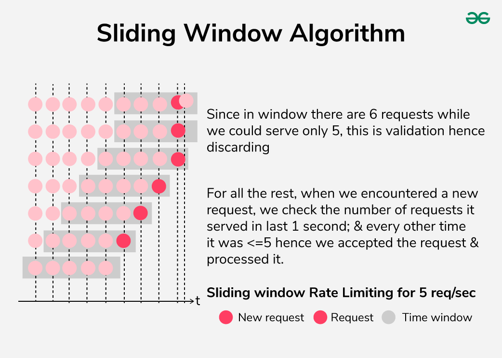
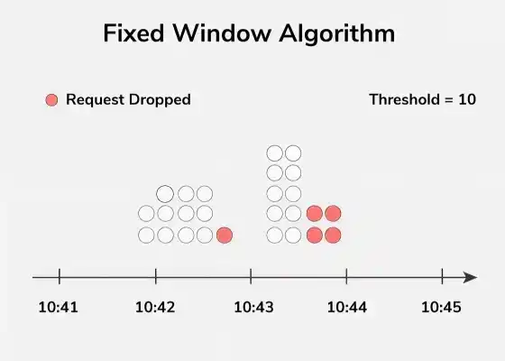
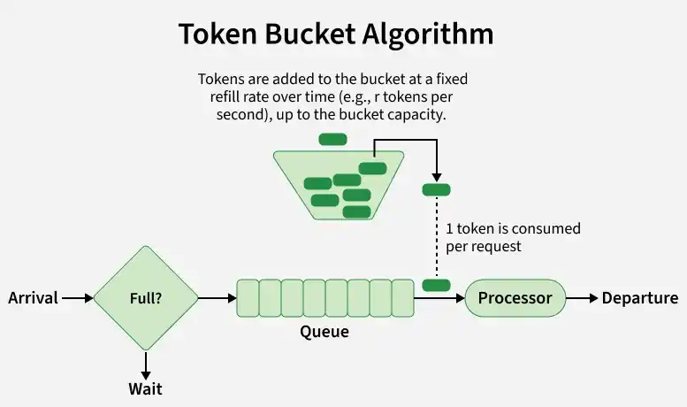
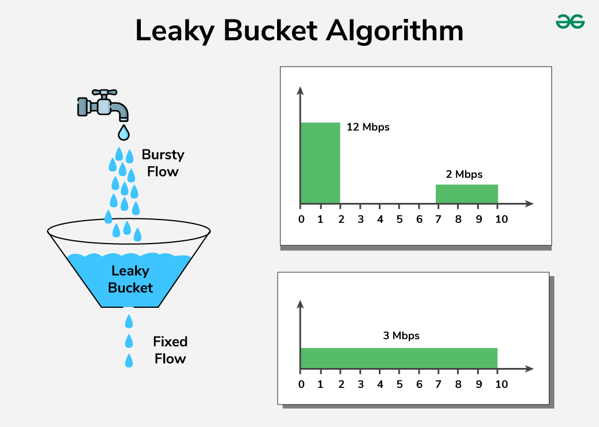

# Algorithms

| Algorithm | Accuracy | Speed | Burst handling | Complexity | Use case |
|---|---|---|---|---|---|
| `sliding_window` *(default)* | High | Fast | Smooth | Medium | General APIs |
| `fixed_window` | Medium | Fastest | 2× at boundary | Low | High-throughput coarse limits |
| `token_bucket` | High | Fast | Absorbs bursts | Medium | Bursty traffic |
| `leaky_bucket` | High | Fast | Flattens bursts | Medium | Traffic shaping |

*Diagrams source: [GeeksForGeeks — Rate Limiting Algorithms](https://www.geeksforgeeks.org/system-design/rate-limiting-algorithms-system-design/)*

---

## Choosing an algorithm

### Traffic pattern

The most important factor. Ask: is your traffic steady or bursty?

| Traffic type | Recommended |
|---|---|
| Steady, predictable flow | `fixed_window` or `sliding_window` |
| Occasional bursts that should be absorbed | `token_bucket` |
| Bursts that must be flattened to a constant rate | `leaky_bucket` |
| Fluctuating traffic with strict accuracy requirements | `sliding_window` |

### Implementation complexity vs. control

- **`fixed_window`** is the simplest to reason about. Use it when the boundary burst caveat is acceptable and you need maximum throughput.
- **`sliding_window`** adds weighted counting to eliminate boundary bursts with minimal extra cost — a good default for most APIs.
- **`token_bucket`** and **`leaky_bucket`** require tracking a continuous state (token count / water level) and are better suited when you need fine-grained burst control.

### Performance and scalability

All four algorithms in Limitra use atomic Redis Lua scripts — they scale horizontally without race conditions. For very high-throughput systems where every millisecond matters, prefer `fixed_window`: it executes a single Redis `INCR` and `EXPIRE`, which is the cheapest possible operation.

### Handling bursts

- **`token_bucket`** — best for absorbing bursts. Clients can send a burst up to the full bucket capacity instantly, then are throttled to the fill rate. Ideal for APIs where occasional spikes are expected and acceptable.
- **`leaky_bucket`** — best for flattening bursts. No matter how fast requests arrive, the output rate stays constant. Use when the downstream system cannot tolerate spikes.
- **`sliding_window`** — handles fluctuating traffic accurately without allowing the 2× boundary burst. A good middle ground when bursts should be dampened but not fully flattened.
- **Hybrid** — combine algorithms when you need both steady-state control and burst tolerance. For example, use `token_bucket` per user with a global `fixed_window` to cap total throughput:

```python
from limitra import LimitraConfig, rate_limit

LimitraConfig(redis_url="redis://localhost:6379", project="my-service")

# Per-user: allows short bursts, throttles long-term
@rate_limit(limits=[(20, 1), (500, 3600)], algorithm="token_bucket", key="user_id")
def api(user_id: str):
    return {"data": "..."}
```

---

## Sliding window

The window slides continuously with time. On each incoming request, Limitra computes a weighted count: the full count from the current slot plus a fraction of the previous slot proportional to how much of it still overlaps the window. This prevents the boundary burst problem of fixed windows.



!!! tip "When to use"
    Default choice for most APIs. Best when traffic fluctuates and you need accurate rate control without boundary bursts. Slightly more complex than fixed window but the accuracy gain is worth it at any scale.

```python
from limitra import LimitraConfig, rate_limit

LimitraConfig(redis_url="redis://localhost:6379", project="my-service")

@rate_limit(requests=100, window=60, algorithm="sliding_window", key="user_id")
def api(user_id: str):
    return {"data": "..."}
```

---

## Fixed window

Time is divided into discrete slots of equal length. Each slot has its own counter, reset to zero at the start of the next slot.



!!! warning "Boundary burst"
    A client can send `requests` calls at the very end of one slot and `requests` again at the very start of the next — effectively 2× the limit in a short period.

!!! tip "When to use"
    Best for high-throughput systems where simplicity and speed matter more than boundary precision — e.g. background jobs, bulk processing, or coarse global limits. The boundary burst is rarely a problem in practice for internal services.

```python
from limitra import LimitraConfig, rate_limit

LimitraConfig(redis_url="redis://localhost:6379", project="my-service")

@rate_limit(requests=1000, window=60, algorithm="fixed_window", key="user_id")
def high_throughput_api(user_id: str):
    return {"data": "..."}
```

---

## Token bucket

A bucket holds up to `requests` tokens. Tokens are added continuously at `requests / window` per second, up to the bucket capacity. Each request consumes one token. When the bucket is empty, the request is rejected.



This allows short bursts (up to the full bucket capacity) while enforcing a long-term average rate equal to the fill rate.

!!! tip "When to use"
    Best when clients have bursty but otherwise well-behaved traffic — e.g. a mobile app that sends several requests in quick succession, then goes quiet. The burst is absorbed without rejection; sustained overuse is throttled.

```python
from limitra import LimitraConfig, rate_limit

LimitraConfig(redis_url="redis://localhost:6379", project="my-service")

# Allows a burst of up to 20 requests, then throttles to 20/60 req/s
@rate_limit(requests=20, window=60, algorithm="token_bucket", key="user_id")
def bursty_api(user_id: str):
    return {"data": "..."}
```

---

## Leaky bucket

Requests fill a bucket like water into a container. The bucket drains at a fixed rate of `requests / window` per second regardless of input. If the bucket is full, incoming requests are dropped.



Unlike token bucket, the output rate is always constant — bursts are absorbed but never result in a faster drain.

!!! tip "When to use"
    Best for traffic shaping in front of a downstream service that cannot handle spikes — e.g. a payment processor, a third-party API with strict rate limits, or a database that performs poorly under bursty load. Guarantees a smooth, predictable request stream regardless of what comes in.

```python
from limitra import LimitraConfig, rate_limit

LimitraConfig(redis_url="redis://localhost:6379", project="my-service")

# Smooths traffic to a constant 100/60 req/s regardless of bursts
@rate_limit(requests=100, window=60, algorithm="leaky_bucket", key="user_id")
def smooth_api(user_id: str):
    return {"data": "..."}
```

---

## Direct use

Use the limiter classes directly without the decorator when you need lower-level control.

```python
import redis
from limitra import SlidingWindowRateLimiter

client = redis.from_url("redis://localhost:6379")

limiter = SlidingWindowRateLimiter(
    capacity=100,
    fill_rate=1/60,
    scope="user",
    backend="redis",
    redis_client=client,
    project="my-svc",
)

user_id = "alice"

if limiter.allow_request(user_id):
    print("Request allowed")
else:
    status = limiter.get_status(user_id)
    wait = limiter.get_wait_time(user_id)
    print(f"Rate limited — {status['count']}/{status['capacity']} used, retry in {wait:.1f}s")
```

`get_usage()` returns a normalised dict across all algorithms:

```python
limiter.get_usage("alice")
# {"count": 42, "limit": 100, "remaining": 58, "limited": False}
```

Available classes: `TokenBucketLimiter`, `LeakyBucketLimiter`, `FixedWindowRateLimiter`, `SlidingWindowRateLimiter`.
